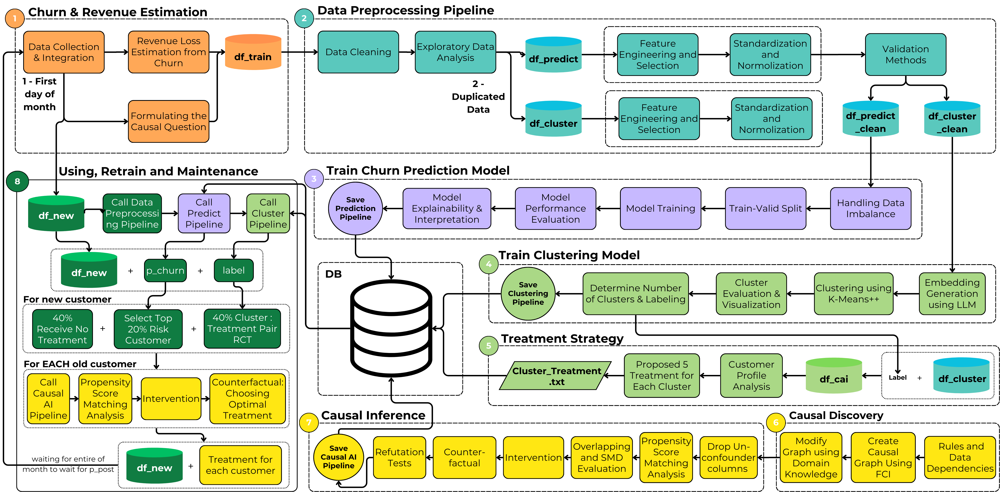

# Causal AI Models: An Automated Treatments Approach to Customer Retention in the Banking Sector

## Context
Customer retention is pivotal in the banking industry, significantly impacting profitability. Traditional churn prediction models, primarily correlation-based, lack actionable insights and fail to provide clear guidance on customer retention strategies. Consequently, banks require advanced analytic solutions to identify not only who is likely to churn but also why they churn and which personalized interventions could effectively prevent attrition.

## Project Overview
This research introduces an innovative Causal Artificial Intelligence (AI) framework designed to enhance customer retention by uncovering causal factors behind churn behaviors and recommending personalized retention treatments. Unlike traditional correlation-based models, this Causal AI approach integrates predictive analytics, dynamic customer segmentation, and causal inference techniques to significantly reduce churn.

## Methodology
The comprehensive end-to-end Causal AI framework comprises:

1. **Churn Risk Identification:**
   - Applied Gradient Boosting Classifier achieving high accuracy (87.4%) to identify customers at risk of churn.

2. **Dynamic Behavioral Segmentation:**
   - Utilized K-Means++ clustering with Large Language Model (LLM) embeddings (Sentence-Transformers/all-mpnet-base-v2) to group customers dynamically into five distinct segments based on behavioral and financial profiles.

3. **Causal Inference for Optimized Interventions:**
   - Implemented causal inference techniques, notably Hybrid Propensity Score Matching (HPSM) and Doubly Robust Learner (DRLearner), to determine the effectiveness of tailored retention treatments.
   - Conducted counterfactual analyses ("What-If" analysis) to explore optimal intervention assignments, substantially improving churn reduction across customer segments.



## Key Results
- Achieved substantial churn reductions, peaking at a 42.39% decrease in high-risk customer segments after optimization.
- Demonstrated superior performance of DRLearner over traditional methods by integrating predictive modeling, segmentation, and causal inference to drive personalized retention strategies.
- Reduced overall customer churn rate from 20.11% to 17.47% through targeted causal interventions.

## Practical Implications
This framework offers banks:
- Data-driven insights into customer behavior with clear causal explanations.
- Optimized allocation of retention resources through individualized treatment recommendations.
- Enhanced customer loyalty and profitability by reducing churn and increasing customer lifetime value.

## Technical Highlights
- **Predictive Modeling:** Gradient Boosting Classifier with robust evaluation metrics (Accuracy, F1-score, ROC-AUC).
- **Advanced Clustering:** K-Means++ clustering combined with LLM-based embeddings to accurately segment customers.
- **Causal Analysis:** Application of Fast Causal Inference (FCI) algorithm, Hybrid Propensity Score Matching, and Doubly Robust Learner for rigorous causal effect estimation.

## Repository Structure
- **Data Preprocessing:** Data normalization, feature engineering, and imbalance handling.
- **Model Training and Evaluation:** Churn prediction models (Gradient Boosting, LightGBM), clustering algorithms.
- **Causal Inference Implementation:** Scripts and notebooks demonstrating causal inference methodologies and refutation tests.
- **Visualization:** Graphical analysis of clusters, treatment effectiveness, and churn reductions.

## Usage
Clone this repository to reproduce results, adapt methodologies, or implement causal AI-driven retention strategies in banking or similar sectors:

```bash
git clone 
```

Follow the provided notebooks for detailed implementation steps and insights.

## Future Work
- Incorporate reinforcement learning for dynamic, real-time intervention adjustments.
- Conduct real-world validations and A/B testing to refine models.
- Expand causal discovery methodologies with Graph Neural Networks (GNNs) for deeper insights.

## References
For detailed theoretical background and comprehensive methodology, please refer to our published paper:

> Vo, M.T., Nguyen, P.D. (2024). *Causal AI Models: An Automated Treatments Approach to Customer Retention in the Banking Sector*. University of Economics and Law, Vietnam National University Ho Chi Minh City, Vietnam.

## Authors
- **Minh Thanh Vo**  
University of Economics and Law, Ho Chi Minh City, Vietnam  
Email: thanhvm21416c@st.uel.edu.vn

---

Feel free to contact the authors for further information or collaboration opportunities.